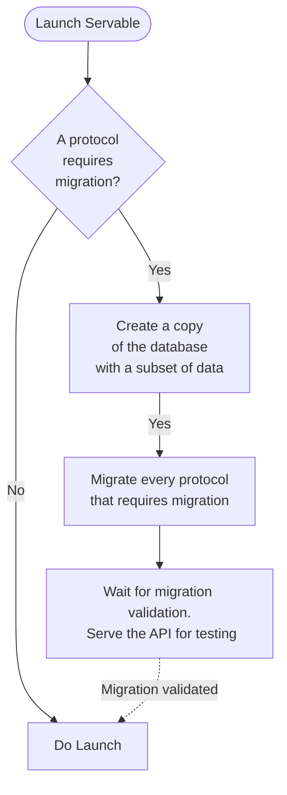
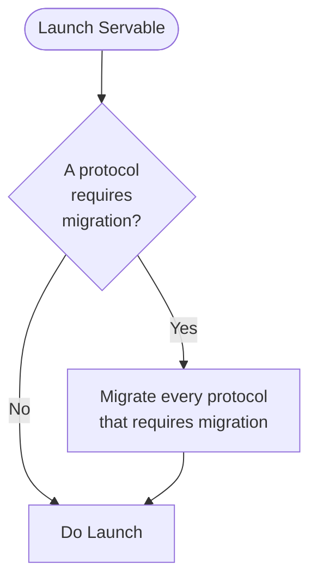

# Configurations
Servable launches with a given configuration. When you generate a new Servable project a list of configurations is provided in servable.engine.config.js.

[Reference](../reference/configuration.md)

## Staging
:::warning
This configuration is still experimental
:::

A staging configuration is helpful when you want to test a schema migration on a staging database without touching the production database. It is an extra protection you can put in your production code.

### On a single instance

### On distributed instances
When this configuration is used in a distributed infrastructure (multi node), the servable-engine acts as an arbitrer to guarantee the server is still accessible on a n-1 version
* Let's say we have **m** instances of our app that are running the version **n** with the staging and the production configurations. **m > 1**
* We deploy a **n+1** version of the app that requires migration. The servable engine will run the staging migration on one server first on a separated subset of the database. It will be served on a /staging endpoint for testing purposes (configurable, see reference)
NB: *The migration status is stored in a special utils database.*
* The **m-2** remaining instances are still running a **n** version of the app and are serving it on the default endpoint of the app (we don't treat the load balancing here) 
* As long as the migration is not validated on the utils database (it's currently done manually), the servable engine acts as an arbiter that maintains the state with 3 rules:
    - There is at most **1** instance with a running staging configuration at a **n+1** version
    - There is at most **m-1** instances with a running production configuration at a **n** version
    - There is at least **1** instance with a running production configuration at a **n** version: when the number of instances is equal to 1, the production configuration is prioritized
* When we validate the migration, the arbiter stops all running instances and restarts them. At this stage the **m** instances boot with a production configuration 
* Only one instance will actually run the migration in a production configuration. the **m-1** instances will restart continually when they realize an ongoing transaction is going on 
* When the migration is done the **m** servers will run the **n+1** version

## Production
A production configuration will handle the whole lifecycle of a Servable, including migrations, running it and exposing the API. 

### On a single instance

### On distributed instances
When this configuration is used in a distributed infrastructure (multi node), the servable-engine acts as an arbitrer to guarantee that the api is not accessible while the migration occurs

* Let's say we have **m** instances of our app that are running the version **n**, **m > 1**
* We deploy a **n+1** version of the app that requires migration. The servable engine will stop all the running instances
NB: *The migration status is stored in a special utils database.*
* Given the pods use a restart policy, servable will detect the first instance that will launch and run the migration on it. All subsequent instances will not launch (will restart after a timeout of 10s) until the migration is done
* Once the migration is done, the instance responsible for the migration will restart automatically and will serve the new **n+1** version
* When the migration is done the **m** servers will run the **n+1** version

