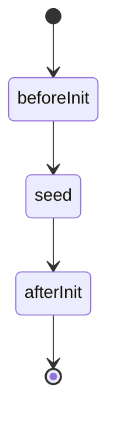

# What is a protocol?

## A better way to group behaviour
Let's say you have an e-commerce application that enables user comments on a blog page and on a product page. You would probably create a table in your database that holds the comments, with a foreign key to the user who made the comment. For performance reasons you would keep the comments count on the object that is being commented, alongside a reference to a "relevant" comment. You would add those fields to both the blog page table and the product page. Every change you would make the comments system design would have to be manually updated to those two tables.

We can do much better by creating a protocol called *commentable* that will be responsible for:

- Defining the schema and creating the tables needed for the comment feature, ie CommentableEntry
- Adding the proper fields to every object that is *commentable*, we call them projected field, in this case they are named CommentableRelevantEntry, CommentableCount
- The security and ACL for the CommentableEntry table and the fields 
- For defining object level behaviour to its own object classes
- For reacting to object events, for example beforeSave, afterSave, beforeDelete, afterDelete and make sure the object is at all time coherent with the protocol rules

By doing so we have packaged the ability to comment into one component that can be reused easily across the project.

A protocol does not stop at the server. Some protocols have a client counterpart that acts in tandem with the server. If we consider the Commentable protocol, it can be distributed in a commentable-server npm package, alongside a commentable-react package that contains React components that can be called on any object that conforms to the protocol. The components include, for a commentable object:
- **CommentableList** that displays a paginated list of comments 
- **CommentableComment** that displays a paginated list of comments
- **CommentableCommentsCount** that displays the total number of comments 
- **CommentableCommentsExcerpt** that displays an excerpt

By making an object Commentable, you're adding not only database fields and server methods to it, you are also taking advantage of a front library made for its capacity.

## Lifecycle
