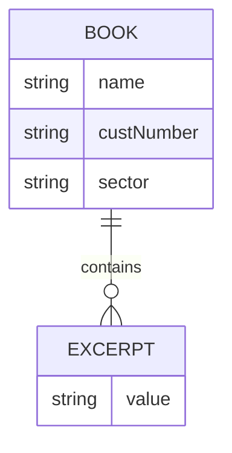

# Server configuration

## Bootstrap
Let's create our Servable app

### 1. Install dependencies
```bash
npm install -g generator-servable
npm install -g yo
```
Get Docker:
https://docs.docker.com/get-docker/

### 2. Create a parent folder for the whole project
```bash
mkdir booklover
cd booklover
```

### 3. Launch docker server

Generate the environment:
```bash
mkdir infrastructure 
cd infrastructure
yo servable:docker
```

Launch the environment:
```bash
docker compose --project-name booklover -f docker-compose.yml up -d
```

:::tip
For **manual installation** the docker file can be found here: **[docker-compose](../static/docker-compose.yaml)**
:::

### 4. Create the app
```bash
cd ..
```

```bash
yo servable --appName Booklover --appId booklover
```

```bash
cd booklover
```

## Data model
At this point the application has 4 tables already:
- A **_User** table 
- A **_Session** table 
- An **_Installation** table 
- A **ServableApp** table that serves as a Servable anchor towards which protocols that are geared towards the whole app will apply to

The _User, _Session and _Installation tables are automatically generated and handled by Parse Server. We will add fields to _User later.

We will need:
- A **Book** table to store the books users have read or want to read
- An **excerpt** table to store books excerpts
- A **Selection** table to store our editorial picks of the day 

The **Book** class will be central to our application as it will be
- bookmarkable
- followable
- commentable
- reactable (likes)
- sharable

The **Excerpt** class will also be central to our application as it allows a finer interaction between users, it will be:
- bookmarkable
- followable
- commentable
- reactable (likes)
- sharable

As we can see the **Book** and the **Excerpt** classes share the same behaviour for basic social interactions. We will naturally extract these functionalities into **protocols** from the get-go.

